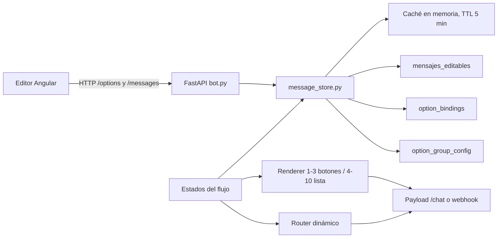

# Integración del front con opciones dinámicas

## Propósito y estado

Este documento es el contrato técnico para construir o adaptar el editor web de opciones del bot. Describe lo que el backend ya implementa, cómo consumirlo y qué reglas debe representar el front sin duplicar lógica de negocio.

La infraestructura, la API, el render automático y el ruteo dinámico ya están implementados en el backend. El front específico para administrar opciones todavía debe construirse. No se realizaron pruebas contra las tablas reales de BigQuery en esta etapa; la implementación fue contrastada localmente y la suite completa del repositorio terminó con **149 pruebas aprobadas**.

Para la preparación operativa y creación de tablas, consultar [CREACION_TABLAS_OPTIONES_BIGQUERY.md](CREACION_TABLAS_OPTIONES_BIGQUERY.md).

## Audiencia

Esta documentación está dirigida a:

- Desarrolladores del front, especialmente del editor Angular.
- Desarrolladores del backend que mantengan el contrato de `/options`.
- QA que deba validar transiciones entre botones y listas.
- Operadores que necesiten distinguir una edición visual de una modificación de ruteo.

## Alcance

El editor debe permitir:

- Listar grupos y sus opciones activas.
- Crear, editar, ordenar y eliminar opciones.
- Configurar el texto de apertura y el título de sección de las listas.
- Reutilizar mensajes de `mensajes_editables` para todos los textos visibles y respuestas.
- Configurar saltos de estado, variables, substeps y handoff.
- Previsualizar si un grupo se representará como botones o lista.
- Mostrar errores de validación del backend de forma comprensible.

No forma parte de este alcance:

- Forzar manualmente botones o lista.
- Crear listas de más de 10 opciones.
- Vaciar completamente un grupo existente.
- Editar directamente filas de BigQuery desde el navegador.
- Compactar el historial append-only.
- Eliminar el código legacy/dead code que se decidió conservar.

## Índice

1. [Arquitectura y flujo de datos](#arquitectura-y-flujo-de-datos)
2. [Conceptos fundamentales](#conceptos-fundamentales)
3. [Modelos persistidos](#modelos-persistidos)
4. [Relación con mensajes editables](#relación-con-mensajes-editables)
5. [Selección automática de botones o lista](#selección-automática-de-botones-o-lista)
6. [Contrato de la API](#contrato-de-la-api)
7. [Validaciones](#validaciones)
8. [Semántica de ruteo](#semántica-de-ruteo)
9. [Mapeo inicial completo](#mapeo-inicial-completo)
10. [Flujos de trabajo del editor](#flujos-de-trabajo-del-editor)
11. [Diseño recomendado del front](#diseño-recomendado-del-front)
12. [Errores, caché y concurrencia](#errores-caché-y-concurrencia)
13. [Payload que consume WhatsApp](#payload-que-consume-whatsapp)
14. [Excepciones que siguen en código](#excepciones-que-siguen-en-código)
15. [Pruebas y criterios de aceptación](#pruebas-y-criterios-de-aceptación)
16. [Limitaciones y trabajo futuro](#limitaciones-y-trabajo-futuro)

## Arquitectura y flujo de datos



El front nunca decide el tipo interactivo persistido, ni construye consultas a BigQuery. Envía comandos a FastAPI; el backend valida, inserta una nueva versión append-only, invalida la caché y devuelve el estado resuelto del grupo.

En ejecución, cada estado declara el `option_group` que le corresponde. El renderer obtiene las opciones activas y el router resuelve el `option_id` seleccionado. Esto permite agregar, eliminar o cambiar el destino de una opción sin editar el estado, salvo las excepciones documentadas más adelante.

## Conceptos fundamentales

### `option_group`

Es el identificador estable de un conjunto de opciones que aparece en un punto concreto del flujo. Ejemplos: `menu_principal`, `login_opciones` o `borrar_nav_confirmar`.

Un grupo activo debe tener entre 1 y 10 opciones. La API no permite borrar la última opción.

### `option_id`

Es el identificador estable de una opción dentro de su grupo. No es su texto visible. Por ejemplo, una opción puede tener `option_id: "no_funciono"` y mostrar “No funcionó”.

En el payload interactivo se transporta el ID crudo. Cuando vuelve desde WhatsApp o desde `/chat`, la entrada normalizada toma la forma `button_{option_id}`, por ejemplo `button_no_funciono`.

`option_id` y `option_group` identifican la clave lógica del historial. No se pueden cambiar con `PUT`: para renombrar un ID se debe crear una opción nueva y luego eliminar la anterior.

### Claves de mensajes

Los campos terminados en `_key` no guardan el texto visible. Referencian una fila vigente de `mensajes_editables`. El backend resuelve esas claves y entrega también `title`, `button_title`, `description`, `button_text` o `section_title` listos para previsualizar.

### Versión activa

Cada modificación agrega una fila. La versión activa es la más reciente por clave lógica, ordenada por `updated_at DESC`. Una versión con `deleted = TRUE` oculta la opción o configuración sin borrar el historial.

### `interactive_type`

Es un valor derivado, no editable:

- De 1 a 3 opciones activas: `button`.
- De 4 a 10 opciones activas: `list`.
- Cero opciones: no renderizable; la API evita llegar a cero mediante borrado normal.
- Más de 10: inválido.

## Modelos persistidos

### `option_bindings`

| Campo | Tipo API / persistencia | Editable | Regla y uso |
|---|---|---:|---|
| `option_group` | string | Solo al crear por URL | Grupo de la opción. Forma la clave lógica junto con `option_id`. |
| `option_id` | string | Solo al crear | ID no vacío y único dentro del grupo. |
| `orden` | integer | Sí | Debe ser mayor o igual a cero. Orden ascendente; ante empate se usa `option_id`. |
| `title_key` | string | Sí | Obligatorio. Debe existir en `mensajes_editables`; texto resuelto de hasta 24 caracteres. |
| `button_title_key` | string o null | Sí | Etiqueta corta alternativa. Si existe, su texto debe medir hasta 20 caracteres. Es obligatoria cuando el título supera 20. |
| `description_key` | string o null | Sí | Descripción para filas de lista; hasta 72 caracteres. No se muestra en botones. |
| `target_state` | string o null | Sí | Estado destino para un salto. Debe figurar en `GET /flow/states`. |
| `target_vars` | objeto JSON, string JSON o null | Sí | Variables de contexto que se aplican antes de enrutar. Debe representar un objeto, no un array o escalar. |
| `stay_in_state` | boolean | Sí | `true` cambia un substep dentro del estado actual; `false` salta a un estado. |
| `target_substep_key` | string o null | Sí | Obligatorio cuando `stay_in_state = true`. |
| `target_substep_value` | string o null | Sí | Obligatorio cuando `stay_in_state = true`. |
| `reply_key` | string o null | Sí | Respuesta inmediata. Es obligatoria para substeps, salvo la excepción `listo` con `{code}`. En saltos actúa como override del prompt destino. |
| `extra_flags` | objeto JSON, string JSON o null | Sí | Flags genéricos. Para soporte se normaliza con `handoff: true`. |
| `deleted` | boolean | No desde el formulario | El backend lo crea al hacer DELETE lógico. |
| `updated_at` | timestamp UTC | No | Fecha de la versión. |
| `version_id` | UUID string | No | ID único de versión y de streaming. |
| `updated_by` | string | Sí, como auditoría | Usuario o sistema que originó la versión. |

Además de los campos persistidos, una lectura devuelve los textos resueltos:

| Campo resuelto | Origen |
|---|---|
| `title` | Contenido actual de `title_key`. |
| `button_title` | Contenido de `button_title_key`, o `title_key` si no hay alternativa. |
| `description` | Contenido de `description_key`, o `null`. |
| `source` | Fuente de la versión: normalmente `bigquery`; puede ser `default` en fallback local. |

### `option_group_config`

Esta tabla solo afecta cómo se presenta una lista. No fuerza que el grupo sea lista.

| Campo | Tipo | Editable | Regla y uso |
|---|---|---:|---|
| `option_group` | string | Por URL | Grupo configurado. |
| `button_text_key` | string | Sí | Mensaje que aparece en el botón que abre la lista; hasta 20 caracteres. |
| `section_title_key` | string | Sí | Mensaje usado como título de la sección; hasta 24 caracteres. |
| `deleted` | boolean | No | Soporte de versionado lógico. |
| `updated_at` | timestamp UTC | No | Fecha de la versión. |
| `version_id` | UUID string | No | ID de versión. |
| `updated_by` | string | Sí, como auditoría | Actor del cambio. |

La lectura de configuración también resuelve:

- `button_text`: contenido actual de `button_text_key`.
- `section_title`: contenido actual de `section_title_key`.
- `source`: `bigquery` o `default-fallback` para un grupo todavía sin configuración persistida.

Al crear la primera opción de un grupo nuevo, el backend persiste automáticamente una configuración genérica con:

- `generic_options_button_text`.
- `generic_options_section_title`.

## Relación con mensajes editables

Una opción separa comportamiento y contenido:

- `option_bindings` decide orden, destino, variables y claves de texto.
- `mensajes_editables` contiene el texto real y sus límites de WhatsApp.
- `option_group_config` elige las claves visuales de una lista.

El front debe cargar el catálogo desde `GET /messages` para poblar selectores. No debe permitir guardar una clave que no exista.

### Tipos y límites relevantes

| Uso | `message_type` recomendado | Límite |
|---|---|---:|
| Etiqueta de botón | `button` | 20 caracteres |
| Título de fila | `list_row_title` | 24 caracteres |
| Descripción de fila | `list_row_description` | 72 caracteres |
| Texto que abre lista | `button_text` | 20 caracteres |
| Título de sección | `list_section_title` | 24 caracteres |
| Respuesta del bot | `text` | 2000 caracteres |

El backend valida el largo del contenido resuelto, no solamente el tipo declarado. El front debe mostrar contador y advertencia antes de enviar, pero la validación definitiva pertenece al backend.

### Título largo y etiqueta corta alternativa

Una fila de lista admite 24 caracteres, pero un botón solo 20. Por eso `button_title_key` permite que la misma opción tenga:

- Un título descriptivo de hasta 24 para la lista.
- Una etiqueta alternativa de hasta 20 para botones.

Si `title` mide 21–24 caracteres, `button_title_key` es obligatorio incluso cuando el grupo hoy tiene 4 o más opciones. La razón es que una eliminación futura puede transformar el grupo en botones.

## Selección automática de botones o lista

La decisión acordada es estricta:

| Opciones activas | Resultado |
|---:|---|
| 1 | Botón |
| 2 | Botones |
| 3 | Botones |
| 4 a 10 | Lista |

No existe un campo `interactive_type` en ninguna escritura y el front no debe ofrecer “forzar lista” ni “forzar botones”. El valor que devuelve la API es informativo y se recalcula a partir de `option_count`.

Consecuencias prácticas:

- Si `menu_principal` baja de 4 a 3 opciones, se transforma realmente en botones sin cambiar código.
- Si un grupo de 3 recibe una cuarta opción, se transforma realmente en lista.
- `button_text_key` y `section_title_key` quedan guardados aunque el grupo esté mostrando botones; volverán a usarse cuando tenga 4 o más.
- El orden y los IDs son los mismos en ambos modos.

## Contrato de la API

### Convenciones generales

- El prefijo funcional es `/options`.
- Los cuerpos son JSON.
- Los modelos rechazan campos extra con HTTP 422.
- Las respuestas de éxito incluyen `ok: true`.
- Las escrituras devuelven el estado vigente completo, no solo la fila insertada.
- `target_vars` y `extra_flags` aceptan un objeto JSON o un string que contenga un objeto JSON. Se recomienda enviar objetos desde el front.
- `updated_by` debe contener la identidad de la persona autenticada en el editor. Hoy la API acepta vacío, pero el front no debería omitirlo.
- Los siete endpoints de opciones no agregan autenticación propia en el código actual. Antes de exponerlos públicamente deben quedar detrás del mecanismo de autenticación/autorización del sistema.

### Forma común de un grupo

```json
{
  "ok": true,
  "option_group": "login_opciones",
  "option_count": 2,
  "interactive_type": "button",
  "options": [
    {
      "option_group": "login_opciones",
      "option_id": "si",
      "orden": 10,
      "title_key": "generic_yes_button",
      "button_title_key": null,
      "description_key": null,
      "target_state": "EstadoPasosInicioSesion",
      "target_vars": "{\"login_step\":3}",
      "stay_in_state": false,
      "target_substep_key": null,
      "target_substep_value": null,
      "reply_key": "login_steps_intro_text",
      "extra_flags": null,
      "deleted": false,
      "updated_at": "2026-07-17T00:00:00+00:00",
      "version_id": "uuid-de-la-version",
      "updated_by": "system-seed",
      "source": "bigquery",
      "title": "Sí",
      "button_title": "Sí",
      "description": null
    }
  ]
}
```

Los strings JSON se conservan serializados en persistencia y respuesta. El editor puede parsearlos para mostrar un constructor visual.

### 1. Listar grupos

```http
GET /options/groups
```

Respuesta 200:

```json
{
  "ok": true,
  "groups": [
    {
      "option_group": "menu_principal",
      "option_count": 4,
      "interactive_type": "list",
      "button_text_key": "main_menu_button_text",
      "section_title_key": "main_menu_section_title"
    }
  ]
}
```

Uso recomendado: pantalla índice del editor. Los grupos se devuelven ordenados alfabéticamente.

### 2. Obtener configuración de un grupo

```http
GET /options/groups/{option_group}/config
```

Ejemplo:

```http
GET /options/groups/menu_principal/config
```

Respuesta 200:

```json
{
  "ok": true,
  "config": {
    "option_group": "menu_principal",
    "button_text_key": "main_menu_button_text",
    "section_title_key": "main_menu_section_title",
    "deleted": false,
    "updated_at": "2026-07-17T00:00:00+00:00",
    "version_id": "uuid-de-la-version",
    "updated_by": "system-seed",
    "source": "bigquery",
    "button_text": "Ver opciones",
    "section_title": "¿En qué te ayudamos?"
  }
}
```

Para un grupo sin configuración persistida, el backend devuelve las claves genéricas y `source: "default-fallback"`.

### 3. Actualizar configuración de un grupo

```http
PUT /options/groups/{option_group}/config
Content-Type: application/json
```

Body:

```json
{
  "button_text_key": "main_menu_button_text",
  "section_title_key": "main_menu_section_title",
  "updated_by": "usuario@empresa.com"
}
```

Respuesta 200: misma forma que el GET de configuración, con la versión nueva ya resuelta.

Errores:

- 422: grupo vacío, clave inexistente o texto resuelto demasiado largo.
- 503: BigQuery no está disponible para persistir.

### 4. Listar opciones de un grupo

```http
GET /options/{option_group}
```

Ejemplo:

```http
GET /options/menu_principal
```

Respuesta 200: forma común de grupo. Un grupo desconocido devuelve 200, `option_count: 0`, `interactive_type: null` y `options: []`.

### 5. Crear una opción

```http
POST /options/{option_group}
Content-Type: application/json
```

Ejemplo de salto:

```json
{
  "option_id": "volver_login",
  "orden": 30,
  "title_key": "volver_login_row_title",
  "button_title_key": "volver_login_button",
  "description_key": "volver_login_row_description",
  "target_state": "EstadoLogin",
  "target_vars": {
    "login_step": 0
  },
  "stay_in_state": false,
  "reply_key": "volver_login_reply",
  "extra_flags": null,
  "updated_by": "usuario@empresa.com"
}
```

Respuesta 201: forma completa del grupo, incluida la nueva opción y el `interactive_type` recalculado.

Ejemplo de substep:

```json
{
  "option_id": "reintentar",
  "orden": 30,
  "title_key": "generic_retry_button",
  "target_state": null,
  "target_vars": null,
  "stay_in_state": true,
  "target_substep_key": "login_step",
  "target_substep_value": "1",
  "reply_key": "login_retry_text",
  "extra_flags": null,
  "updated_by": "usuario@empresa.com"
}
```

Errores:

- 409: el `option_id` ya existe o el grupo alcanzó el máximo de 10.
- 422: campos, mensajes, JSON, longitudes o ruteo inválidos.
- 503: BigQuery no está disponible.

### 6. Actualizar una opción

```http
PUT /options/{option_group}/{option_id}
Content-Type: application/json
```

Solo se envían los campos que cambian:

```json
{
  "orden": 15,
  "reply_key": "login_steps_intro_alternative_text",
  "target_vars": {
    "login_step": 2
  },
  "updated_by": "usuario@empresa.com"
}
```

Respuesta 200: forma completa del grupo con la versión nueva.

No se pueden editar `option_group`, `option_id`, `deleted`, `updated_at`, `version_id` ni `source`.

Errores:

- 404: la opción activa no existe.
- 422: body sin cambios, estado no registrado, campo extra o configuración inválida.
- 503: BigQuery no está disponible.

### 7. Eliminar una opción

```http
DELETE /options/{option_group}/{option_id}?updated_by=usuario%40empresa.com
```

Respuesta 200: forma completa del grupo sin la opción eliminada. La fila no se borra físicamente; se inserta una versión con `deleted = TRUE`.

Errores:

- 404: la opción activa no existe.
- 409: se intenta eliminar la última opción o una compensación de concurrencia impide dejar el grupo vacío.
- 503: BigQuery no está disponible.

### Endpoint auxiliar: estados registrados

```http
GET /flow/states
```

Respuesta:

```json
{
  "ok": true,
  "states": [
    {
      "state_name": "EstadoLogin",
      "state_class": "EstadoLogin"
    }
  ],
  "count": 14
}
```

El selector de `target_state` debe usar este endpoint como fuente de verdad, no una lista duplicada en Angular.

### Endpoints auxiliares de mensajes

El editor de opciones depende del catálogo existente:

| Método | Ruta | Uso |
|---|---|---|
| GET | `/messages` | Listar claves, contenido, tipo y metadatos. |
| POST | `/messages` | Crear una clave antes de referenciarla. |
| PUT | `/messages/{message_key}` | Cambiar el texto de una clave. |
| POST | `/messages/{message_key}/reset` | Restaurar su contenido por defecto. |
| PATCH | `/messages/reorder` | Reordenar mensajes en el editor existente. |

Una edición de contenido no exige actualizar `option_bindings`: cualquier opción que use esa clave reflejará el nuevo texto al refrescar la caché.

## Validaciones

El front debe anticipar estas reglas para mejorar la experiencia, pero nunca reemplazar la validación del backend.

### Matriz de validación de una opción

| Regla | Crear | Editar | Eliminar | Resultado esperado |
|---|---:|---:|---:|---|
| `option_group` no vacío | Sí | Sí, desde URL | Sí, desde URL | 422 si está vacío. |
| `option_id` no vacío | Sí | Sí, desde URL | Sí, desde URL | 422 si está vacío. |
| ID único en el grupo | Sí | No cambia | N/A | 409 si ya existe. |
| `orden` entero >= 0 | Sí | Si se envía | N/A | 422 si es inválido. |
| Máximo 10 activas | Sí | N/A | N/A | 409 al intentar crear la undécima. |
| Mínimo 1 activa | N/A | N/A | Sí | 409 al borrar la última. |
| `title_key` existente | Sí | Si cambia | N/A | 422 si no existe. |
| Título <= 24 | Sí | Sí | N/A | 422 si excede. |
| Etiqueta corta <= 20 | Si existe | Si cambia | N/A | 422 si excede. |
| Etiqueta corta requerida si título > 20 | Sí | Sí | N/A | 422 si falta. |
| Descripción <= 72 | Si existe | Si cambia | N/A | 422 si excede. |
| `reply_key` existente | Si existe/requerida | Si cambia | N/A | 422 si no existe. |
| `target_state` registrado | Si existe | Si cambia | N/A | 422 si no figura en `/flow/states`. |
| `target_vars` es objeto JSON | Si existe | Si cambia | N/A | 422 para JSON inválido, array o escalar. |
| `extra_flags` es objeto JSON | Si existe | Si cambia | N/A | 422 para JSON inválido, array o escalar. |
| Substep key/value si `stay_in_state` | Sí | Sí | N/A | 422 si falta cualquiera. |
| `reply_key` en substep | Sí | Sí | N/A | 422 si falta, salvo excepción `listo`. |
| Sin campos desconocidos | Sí | Sí | N/A | 422 de Pydantic. |
| Al menos un cambio en PUT | N/A | Sí | N/A | 422 si solo llega `updated_by` o body vacío. |

### Normalización automática del backend

Al guardar, el backend normaliza combinaciones para evitar estados ambiguos:

- Si `stay_in_state = true`, fuerza `target_state = null`.
- Si `stay_in_state = false`, fuerza `target_substep_key = null` y `target_substep_value = null`.
- Si el salto no tiene `target_state`, se interpreta como soporte.
- Si `target_state = "EstadoSoporte"` o no existe, agrega `handoff: true` a `extra_flags`. `reply_key` se conserva nulo cuando la opción no tiene respuesta propia; en ese caso el estado destino aporta su mensaje.
- Los objetos JSON se almacenan como strings JSON compactos.
- Espacios externos de `option_group` y `option_id` se eliminan.

El front debe mostrar la respuesta devuelta por el servidor después de guardar, porque puede contener estos valores normalizados.

### Orden

El seed usa 10, 20, 30 y 40 para dejar espacio entre opciones. El front puede usar drag & drop y recalcular órdenes con incrementos de 10. El endpoint no exige que sean consecutivos ni únicos.

No existe un endpoint de reorder masivo para opciones. Cada opción cuyo `orden` cambie requiere un `PUT` individual. Para una experiencia robusta:

1. Calcular todos los órdenes finales localmente.
2. Enviar solo los PUT necesarios.
3. Refrescar el grupo al terminar.
4. Si una petición falla, informar resultado parcial y volver a cargar desde el backend.

## Semántica de ruteo

El editor debe presentar dos modos mutuamente excluyentes.

### Modo 1: saltar a otro estado

Configuración:

```json
{
  "stay_in_state": false,
  "target_state": "EstadoLogin",
  "target_vars": {
    "login_step": 0
  },
  "reply_key": "optional_override_text",
  "extra_flags": null
}
```

Comportamiento:

1. Se aplican las propiedades de `target_vars` al contexto.
2. Si `reply_key` tiene valor, ese mensaje es la respuesta inmediata.
3. Si `reply_key` es `null`, el estado destino produce su `prompt()` cuando corresponde.
4. Se cambia a `target_state`.

La regla de `reply_key` es deliberadamente híbrida: puede usarse en saltos y substeps. En un salto funciona como override del prompt del destino.

### Modo 2: permanecer y cambiar substep

Configuración:

```json
{
  "stay_in_state": true,
  "target_state": null,
  "target_substep_key": "form_substep",
  "target_substep_value": "pregunta_cuando",
  "reply_key": "ask_when_loaded_text"
}
```

Comportamiento:

1. Se aplican primero las propiedades de `target_vars`, si existen.
2. Se asigna `context[target_substep_key] = target_substep_value`.
3. Se responde con el contenido de `reply_key`.
4. El estado actual no cambia.

Los substeps siempre deben tener `reply_key`, excepto `borrar_nav_esperando_confirmacion/listo`, cuya respuesta depende de `{code}` y del flujo.

### Soporte y handoff

La decisión implementada para soporte es: **`reply_key` en cada salto por botón y ningún `prompt()` en `EstadoSoporte`**.

Configuración recomendada:

```json
{
  "stay_in_state": false,
  "target_state": "EstadoSoporte",
  "reply_key": "handoff_text",
  "extra_flags": {
    "handoff": true
  }
}
```

El backend refuerza el handoff. Aunque el editor omita el flag, normaliza el salto a soporte con `handoff: true`. El `reply_key` es opcional: si falta, el runtime usa el mensaje canónico de soporte como respuesta del estado destino.

### Destino vacío o inválido en runtime

- Durante una escritura API, un `target_state` no registrado se rechaza con 422.
- En runtime, si una versión inválida llegara desde datos externos, el router registra el error y deriva a `EstadoSoporte`.
- Un salto con destino vacío también se normaliza a soporte.
- Si una opción enviada al usuario fue eliminada antes de que la pulse, el router responde con handoff y deriva a soporte.

### `target_vars`

Es un objeto genérico de variables de contexto. Ejemplo:

```json
{
  "intentos_identificacion": 0,
  "opcion_inicial": "registro",
  "flujo": "registro"
}
```

El front puede ofrecer un editor clave/valor y una vista JSON avanzada. Debe permitir números, booleanos, strings, `null`, arrays como valor de una propiedad y objetos anidados; el valor raíz siempre debe ser un objeto.

### `extra_flags`

Es otro objeto genérico, separado de las variables persistentes del flujo. Sus propiedades se agregan al payload de respuesta. El uso implementado hoy es:

```json
{
  "handoff": true
}
```

No debe confundirse con `target_vars`: `target_vars` modifica el contexto del flujo; `extra_flags` modifica propiedades adicionales de la respuesta.

## Mapeo inicial histórico (superado por el editor unificado)

Este apartado conserva el snapshot original de 17 grupos y 34 opciones como referencia de la
API fina. El seed vigente está documentado en `Plan.md`: contiene 26 grupos y 47 opciones y el
frontend de producto consume `GET /editor/blocks`.

### Resumen de grupos

| Grupo | Cantidad inicial | Presentación inicial | Punto del flujo |
|---|---:|---|---|
| `menu_principal` | 4 | Lista | Menú principal. |
| `info_pedido_opciones` | 2 | Botones | Respuesta sobre información de pedido. |
| `registro_mail_empresa_opciones` | 2 | Botones | Resultado de validación del mail corporativo. |
| `login_opciones` | 2 | Botones | Consulta de acceso previo. |
| `pasos_inicio_sesion_resultado` | 2 | Botones | Resultado de pasos de inicio de sesión. |
| `consulta_adicional_opciones` | 2 | Botones | Confirmación de otra consulta. |
| `finalizado_opciones` | 1 | Botón | Opción visual de volver al inicio. |
| `portal_beneficios_opciones` | 2 | Botones | Acceso al portal de beneficios. |
| `descuentos_pregunta_cargaste` | 2 | Botones | Carga de datos de descuentos. |
| `descuentos_pregunta_cuando` | 2 | Botones | Antigüedad de la carga de descuentos. |
| `formulario_pregunta_cargaste` | 2 | Botones | Carga del formulario. |
| `formulario_pregunta_cuando` | 2 | Botones | Antigüedad de la carga del formulario. |
| `borrar_nav_confirmar` | 2 | Botones | Confirmación para borrar navegación. |
| `borrar_nav_explicar_motivo` | 2 | Botones | Confirmación después de explicar el motivo. |
| `borrar_nav_sabe_como` | 2 | Botones | Confirmación de conocimiento del procedimiento. |
| `borrar_nav_esperando_confirmacion` | 1 | Botón | Confirmación de tarea terminada. |
| `borrar_nav_finalizado` | 2 | Botones | Resultado de borrar navegación. |

### 1. `menu_principal`

| ID | Orden | Textos | Destino | Variables / respuesta |
|---|---:|---|---|---|
| `registro` | 10 | `main_menu_row_registro_title`; corta `main_menu_button_registro_title`; descripción `main_menu_row_registro_description` | `EstadoPreFlujo` | `intentos_identificacion=0`, `opcion_inicial=registro`, `flujo=registro`. |
| `no_veo_precios` | 20 | `main_menu_row_no_veo_precios_title`; descripción `main_menu_row_no_veo_precios_description` | `EstadoPreFlujo` | `intentos_identificacion=0`, `opcion_inicial=no_veo_precios`, `flujo=precios`. |
| `no_veo_descuentos` | 30 | `main_menu_row_no_veo_descuentos_title`; descripción `main_menu_row_no_veo_descuentos_description` | `EstadoPreFlujo` | `intentos_identificacion=0`, `opcion_inicial=no_veo_descuentos`, `flujo=descuentos`. |
| `info_pedido` | 40 | `main_menu_row_info_pedido_title`; descripción `main_menu_row_info_pedido_description` | `EstadoPreFlujo` | `intentos_identificacion=0`, `opcion_inicial=info_pedido`. |

Configuración de lista: `main_menu_button_text` y `main_menu_section_title`.

### 2. `info_pedido_opciones`

| ID | Orden | Título | Destino |
|---|---:|---|---|
| `si` | 10 | `generic_yes_button` | `EstadoInicial` |
| `no` | 20 | `generic_no_button` | `EstadoFinalizado` |

### 3. `registro_mail_empresa_opciones`

| ID | Orden | Título | Destino | Variables / respuesta |
|---|---:|---|---|---|
| `si` | 10 | `generic_yes_button` | `EstadoConsultaAdicional` | Sin override. |
| `no` | 20 | `generic_no_button` | `EstadoBorrarNavegacion` | `clear_nav_step=confirmar`; responde `borrar_nav_confirm_text`. |

### 4. `login_opciones`

| ID | Orden | Título | Destino | Variables / respuesta |
|---|---:|---|---|---|
| `si` | 10 | `generic_yes_button` | `EstadoPasosInicioSesion` | `login_step=3`; responde `login_steps_intro_text`. |
| `no` | 20 | `generic_no_button` | `EstadoFormulario` | Usa el prompt del destino. |

### 5. `pasos_inicio_sesion_resultado`

| ID | Orden | Título | Destino | Variables / respuesta |
|---|---:|---|---|---|
| `funciono` | 10 | `generic_funciono_button` | `EstadoConsultaAdicional` | `login_step=0`. |
| `no_funciono` | 20 | `generic_no_funciono_button` | `EstadoSoporte` | `handoff_text`; `handoff=true`. |

### 6. `consulta_adicional_opciones`

| ID | Orden | Título | Destino |
|---|---:|---|---|
| `si` | 10 | `generic_yes_button` | `EstadoInicial` |
| `no` | 20 | `generic_no_button` | `EstadoFinalizado` |

### 7. `finalizado_opciones`

| ID | Orden | Título | Destino |
|---|---:|---|---|
| `volver` | 10 | `volver_inicio_button` | `EstadoInicial` |

Esta opción se preserva en el mapeo, pero el controlador reinicia una sesión terminal antes de que la rama sea operativa. Ver [Excepciones que siguen en código](#excepciones-que-siguen-en-código).

### 8. `portal_beneficios_opciones`

| ID | Orden | Título | Destino | Respuesta |
|---|---:|---|---|---|
| `si` | 10 | `generic_yes_button` | `EstadoBorrarNavegacion` | `portal_beneficios_clear_nav_text`. |
| `no` | 20 | `generic_no_button` | `EstadoLogin` | Usa el prompt del destino. |

### 9. `descuentos_pregunta_cargaste`

| ID | Orden | Título | Substep | Respuesta |
|---|---:|---|---|---|
| `si` | 10 | `generic_si_loaded_button` | `descuentos_substep=pregunta_cuando` | `ask_when_loaded_text`. |
| `no` | 20 | `generic_no_loaded_button` | `descuentos_substep=fin` | `descuentos_not_loaded_text`. |

### 10. `descuentos_pregunta_cuando`

| ID | Orden | Título | Acción | Respuesta |
|---|---:|---|---|---|
| `menos_48` | 10 | `generic_menos_48_button` | Permanece; `descuentos_substep=fin`. | `descuentos_wait_48_text`. |
| `mas_48` | 20 | `generic_mas_48_button` | Salta a `EstadoPasosInicioSesion`; aplica `descuentos_substep=esperando_resultado`. | `descuentos_login_steps_text`. |

### 11. `formulario_pregunta_cargaste`

| ID | Orden | Título | Substep | Respuesta |
|---|---:|---|---|---|
| `si` | 10 | `generic_si_loaded_button` | `form_substep=pregunta_cuando` | `ask_when_loaded_text`. |
| `no` | 20 | `generic_no_loaded_button` | `form_substep=fin` | `not_loaded_form_text`. |

### 12. `formulario_pregunta_cuando`

| ID | Orden | Título | Acción | Respuesta |
|---|---:|---|---|---|
| `menos_48` | 10 | `generic_menos_48_button` | Permanece; `form_substep=fin`. | `wait_48_form_text`. |
| `mas_48` | 20 | `generic_mas_48_button` | Salta a `EstadoPasosInicioSesion`; aplica `form_substep=fin`. | `formulario_login_steps_text`. |

### 13. `borrar_nav_confirmar`

| ID | Orden | Título | Substep | Respuesta |
|---|---:|---|---|---|
| `si` | 10 | `generic_yes_button` | `clear_nav_step=sabe_como` | `borrar_nav_ask_know_how_text`. |
| `no` | 20 | `generic_no_button` | `clear_nav_step=explicar_motivo` | `borrar_nav_explain_why_text`. |

### 14. `borrar_nav_explicar_motivo`

| ID | Orden | Título | Substep | Respuesta |
|---|---:|---|---|---|
| `si` | 10 | `generic_yes_button` | `clear_nav_step=esperando_confirmacion` | `borrar_nav_wait_finish_text`. |
| `no` | 20 | `generic_no_button` | `clear_nav_step=explicar_como` | `borrar_nav_how_to_text`. |

### 15. `borrar_nav_sabe_como`

| ID | Orden | Título | Substep | Respuesta |
|---|---:|---|---|---|
| `si` | 10 | `generic_yes_button` | `clear_nav_step=esperando_confirmacion` | `borrar_nav_wait_finish_text`. |
| `no` | 20 | `generic_no_button` | `clear_nav_step=explicar_como` | `borrar_nav_how_to_text`. |

### 16. `borrar_nav_esperando_confirmacion`

| ID | Orden | Título | Substep | Respuesta |
|---|---:|---|---|---|
| `listo` | 10 | `generic_listo_button` | `clear_nav_step=finalizado` | Excepción hardcodeada que interpola `{code}` y varía por flujo. |

### 17. `borrar_nav_finalizado`

| ID | Orden | Título | Destino | Respuesta |
|---|---:|---|---|---|
| `funciono` | 10 | `generic_funciono_button` | `EstadoConsultaAdicional` | Usa el prompt del destino. |
| `no_funciono` | 20 | `generic_no_funciono_button` | `EstadoSoporte` | `handoff_text`; `handoff=true`. |

Salvo `menu_principal`, todos los seeds de configuración usan `generic_options_button_text` y `generic_options_section_title`. Esas claves solo se ven si el grupo alcanza cuatro opciones.

## Flujos de trabajo del editor

### Crear una opción reutilizando mensajes existentes

1. Cargar `GET /messages`, `GET /flow/states` y `GET /options/{group}`.
2. Elegir un `option_id` estable, técnico y sin dependencia del texto visible.
3. Seleccionar `title_key`, y opcionalmente `button_title_key` y `description_key`.
4. Elegir salto o substep.
5. Completar destino, respuesta y variables según el modo.
6. Previsualizar el tipo interactivo que resultará después de crearla.
7. Enviar `POST /options/{group}`.
8. Reemplazar el estado local por la respuesta completa del servidor.

### Crear primero una clave de mensaje

Si el texto todavía no existe:

1. Abrir el editor de mensajes o un diálogo integrado.
2. Crear la clave con `POST /messages`, usando el `message_type` correcto.
3. Refrescar `GET /messages`.
4. Seleccionar la clave nueva en el formulario de opción.
5. Guardar la opción.

No conviene enviar en paralelo la creación de mensaje y opción: la segunda puede validarse antes de que la primera quede visible y fallar por clave inexistente.

### Editar solamente el texto

Si no cambia el comportamiento:

1. Editar el contenido mediante `PUT /messages/{key}`.
2. No enviar ningún PUT a `/options`.
3. Refrescar el grupo para actualizar los textos resueltos de la previsualización.

Todas las opciones que compartan la clave verán el cambio.

### Editar destino o respuesta

1. Obtener la versión vigente con `GET /options/{group}`.
2. Enviar solo las propiedades modificadas a `PUT /options/{group}/{id}`.
3. Usar la respuesta del servidor para reflejar normalizaciones.

El PUT es parcial. En particular, enviar `target_state: null` cuenta como un cambio explícito; omitirlo significa conservar el valor vigente.

### Eliminar una opción

1. Mostrar una confirmación que incluya grupo, ID y texto visible.
2. Indicar el tipo resultante si cambia el umbral, por ejemplo: “El grupo pasará de lista a 3 botones”.
3. Bloquear la acción si el front ya sabe que solo queda una opción.
4. Ejecutar el DELETE con `updated_by`.
5. Reemplazar el grupo local por la respuesta.

El backend vuelve a validar el mínimo para cubrir ediciones concurrentes.

### Pasar de 3 botones a lista

Al crear la cuarta opción:

1. Las cuatro opciones deben tener `title` de hasta 24 caracteres.
2. Cualquier título que supere 20 debe tener `button_title_key`, porque el grupo podría volver a botones.
3. Debe existir configuración de grupo válida.
4. El POST devuelve `interactive_type: "list"`.
5. La previsualización debe usar `button_text`, `section_title`, `title` y `description`.

No se modifica `interactive_type`: el cambio ocurre por cantidad.

### Pasar de lista a 3 botones

Al eliminar una opción de un grupo de cuatro:

1. Mostrar antes de confirmar que cambiará la presentación.
2. Verificar que todas las opciones restantes tienen `button_title` de hasta 20.
3. Ejecutar el DELETE.
4. La respuesta devuelve `interactive_type: "button"`.
5. La configuración de lista se conserva para un posible regreso a cuatro opciones.

Este caso cubre la necesidad de eliminar elementos de `menu_principal` y convertirlo realmente en botones.

### Configurar la presentación de listas

1. Crear o elegir una clave `button_text` de hasta 20 caracteres.
2. Crear o elegir una clave `list_section_title` de hasta 24 caracteres.
3. Enviar ambas a `PUT /options/groups/{group}/config`.
4. Mostrar los textos resueltos devueltos por el backend.

La configuración puede editarse cuando el grupo tiene 1–3 opciones, aunque no se verá hasta que el grupo sea lista.

### Configurar una derivación a soporte

El formulario debe completar o sugerir automáticamente:

- `target_state = EstadoSoporte`.
- `reply_key = handoff_text` u otra clave de respuesta aprobada.
- `extra_flags = { "handoff": true }`.
- `stay_in_state = false`.

El backend también normaliza estos valores, pero mostrarlos explícitos evita configuraciones sorprendentes.

## Diseño recomendado del front

### Encaje con el Angular actual

El proyecto `MotoBot-Front/front-log` ya utiliza:

- Componentes standalone.
- Signals y `computed`.
- `HttpClient` en servicios `providedIn: 'root'`.
- Lazy loading de rutas.
- `authGuard` en las pantallas privadas.
- Proxy de desarrollo `/api` hacia `http://localhost:8000`.
- Angular CDK Drag & Drop en el editor de mensajes.

El editor de opciones debe seguir esos patrones. Se recomienda una ruta privada, por ejemplo `/editor-opciones`, protegida por `authGuard`, y un `BotOptionsService` separado de `BotMessagesService`.

### Cambios necesarios en configuración del front

Agregar a ambos archivos de environment:

```ts
optionsApiUrl: '/api/options',
flowStatesApiUrl: '/api/flow/states',
```

El proxy existente ya elimina `/api`, por lo que en desarrollo no requiere una regla adicional.

### Correcciones necesarias en el catálogo de mensajes del front

El contrato actual de `BotMessageType` debe ampliarse:

```ts
export type BotMessageType =
  | 'text'
  | 'button'
  | 'button_text'
  | 'list_row_title'
  | 'list_row_description'
  | 'list_section_title';
```

La tabla de límites debe quedar alineada con el backend:

```ts
export const MESSAGE_LIMITS: Readonly<Record<BotMessageType, number>> = {
  text: 2000,
  button: 20,
  button_text: 20,
  list_row_title: 24,
  list_row_description: 72,
  list_section_title: 24,
};
```

En el front actual `button_text` figura con límite 2000 y falta `list_section_title`. Ambos deben corregirse antes de usar el editor de configuración de listas.

### Tipos TypeScript sugeridos

```ts
export type InteractiveType = 'button' | 'list' | null;

export interface OptionBinding {
  readonly option_group: string;
  readonly option_id: string;
  readonly orden: number;
  readonly title_key: string;
  readonly button_title_key: string | null;
  readonly description_key: string | null;
  readonly target_state: string | null;
  readonly target_vars: string | null;
  readonly stay_in_state: boolean;
  readonly target_substep_key: string | null;
  readonly target_substep_value: string | null;
  readonly reply_key: string | null;
  readonly extra_flags: string | null;
  readonly deleted: boolean;
  readonly updated_at: string | null;
  readonly version_id: string | null;
  readonly updated_by: string | null;
  readonly source: string;
  readonly title: string;
  readonly button_title: string;
  readonly description: string | null;
}

export interface OptionGroupPayload {
  readonly ok: boolean;
  readonly option_group: string;
  readonly option_count: number;
  readonly interactive_type: InteractiveType;
  readonly options: readonly OptionBinding[];
}

export interface OptionGroupSummary {
  readonly option_group: string;
  readonly option_count: number;
  readonly interactive_type: InteractiveType;
  readonly button_text_key: string;
  readonly section_title_key: string;
}

export interface OptionGroupConfig {
  readonly option_group: string;
  readonly button_text_key: string;
  readonly section_title_key: string;
  readonly button_text: string;
  readonly section_title: string;
  readonly updated_at: string | null;
  readonly version_id: string | null;
  readonly updated_by: string | null;
  readonly source: string;
}
```

Para requests conviene declarar interfaces separadas y no reutilizar el modelo de lectura, evitando enviar campos inmutables por accidente.

### Métodos sugeridos de servicio

```ts
getGroups(): Observable<readonly OptionGroupSummary[]>;
getGroup(group: string): Observable<OptionGroupPayload>;
getGroupConfig(group: string): Observable<OptionGroupConfig>;
createOption(group: string, payload: CreateOptionPayload): Observable<OptionGroupPayload>;
updateOption(group: string, id: string, payload: UpdateOptionPayload): Observable<OptionGroupPayload>;
deleteOption(group: string, id: string, updatedBy: string): Observable<OptionGroupPayload>;
updateGroupConfig(group: string, payload: GroupConfigPayload): Observable<OptionGroupConfig>;
getFlowStates(): Observable<readonly FlowStateSummary[]>;
```

`group` e `id` deben pasar por `encodeURIComponent`. Lo mismo aplica a `updated_by` en el query string del DELETE.

### Pantalla índice de grupos

Cada tarjeta o fila debería mostrar:

- Nombre técnico del grupo.
- Cantidad de opciones.
- Badge `Botones` o `Lista`.
- Vista resumida de los textos.
- Advertencia si `source` indica fallback.
- Acción “Administrar”.

No se debe calcular el badge únicamente en el front si la respuesta ya trae `interactive_type`; la cantidad sirve para explicar, y el valor del servidor es la fuente de verdad.

### Pantalla de detalle

Se recomienda dividirla en tres áreas:

1. Lista ordenable de opciones.
2. Formulario de la opción seleccionada.
3. Previsualización del interactivo resultante.

Cabecera sugerida:

- `option_group`.
- `option_count / 10`.
- Tipo automático actual.
- Aviso del próximo umbral: “Si agregás una opción, pasará a lista”.
- Acceso a configuración de lista.

### Formulario de opción

#### Identidad y orden

- `option_id`: editable solo al crear.
- `orden`: input numérico y drag & drop.
- `updated_by`: obtenido de la sesión, no pedido manualmente si ya existe identidad.

#### Contenido visible

Los selectores deben mostrar `message_key`, label, contenido actual, tipo y cantidad de caracteres.

- `title_key`: obligatorio; filtrar preferentemente `list_row_title` y `button`.
- `button_title_key`: opcional; filtrar `button`.
- `description_key`: opcional; filtrar `list_row_description`.

No se debe ocultar por completo `button_title_key` cuando el grupo sea lista: sigue siendo necesario para una futura conversión a botones.

#### Acción

Control segmentado:

- “Ir a otro estado” → `stay_in_state = false`.
- “Permanecer y cambiar paso” → `stay_in_state = true`.

En salto:

- Selector `target_state` desde `/flow/states`.
- Selector opcional `reply_key` de tipo `text`.
- Constructor de `target_vars`.
- Constructor avanzado de `extra_flags`.

En substep:

- Ocultar o limpiar `target_state`.
- Mostrar `target_substep_key` y `target_substep_value`.
- Marcar `reply_key` como obligatorio.
- Mantener disponibles `target_vars` y `extra_flags` como opciones avanzadas.

Si se elige `EstadoSoporte`, mostrar un preset de handoff.

### Configuración de lista

El panel debe explicar que no fuerza una lista. Controles:

- Selector `button_text_key`, filtrado por `button_text`.
- Selector `section_title_key`, filtrado por `list_section_title`.
- Preview del botón de apertura y la sección.

Si el grupo tiene menos de cuatro opciones, mostrar: “Esta configuración se conserva y se usará cuando el grupo tenga 4 o más opciones”.

### Previsualización

La previsualización debe usar exclusivamente datos resueltos de la respuesta del backend:

- Botones: `option.button_title`.
- Lista: `config.button_text`, `config.section_title`, `option.title` y `option.description`.
- Orden: array devuelto por la API.

Al editar un formulario todavía no guardado puede existir un preview local provisional, claramente marcado como “Sin guardar”. Después del éxito debe reemplazarse por la respuesta canónica.

### Confirmaciones

Pedir confirmación al:

- Eliminar una opción.
- Cambiar de salto a substep o viceversa si hay campos que se limpiarán.
- Cambiar el destino a soporte.
- Provocar un cambio de 3 botones a lista o de 4 a 3 botones.
- Reordenar múltiples opciones si la operación se implementa mediante varios PUT.

### Edición de JSON

Se recomienda un constructor clave/valor y un modo avanzado JSON. Antes de enviar:

- Parsear el texto.
- Rechazar raíz que no sea objeto.
- Conservar tipos primitivos.
- Mostrar el JSON normalizado en la revisión.

No usar `eval` ni convertir todos los valores a string.

## Errores, caché y concurrencia

### Experiencia según código HTTP

| HTTP | Significado habitual | UX recomendada |
|---:|---|---|
| 200 / 201 | Operación exitosa | Reemplazar datos locales por la respuesta y mostrar confirmación. |
| 404 | Opción ya no existe | Avisar posible edición concurrente y recargar el grupo. |
| 409 | Conflicto lógico | Mostrar `detail`, conservar formulario y recargar antes de reintentar. |
| 422 | Formulario o ruteo inválido | Mostrar `detail` junto al campo; para errores Pydantic presentar la lista. |
| 503 | BigQuery no disponible | Indicar que no se guardó; no hacer actualización optimista permanente. |

Formato frecuente de error del backend:

```json
{
  "detail": "button_title_key es obligatorio cuando title_key excede 20 caracteres"
}
```

FastAPI puede devolver `detail` como array para validaciones estructurales. El adaptador de errores del front debe soportar string y array.

### Fallback sin BigQuery

Si BigQuery no está configurado o falla una carga, el backend puede servir defaults locales. Las lecturas pueden funcionar, pero las escrituras devolverán 503.

El front debe:

- Mostrar una advertencia si las opciones tienen `source: "default"` o la configuración tiene
  `source: "default"`/`"default-fallback"`.
- No interpretar un GET exitoso como confirmación de persistencia.
- Mantener acciones visibles pero explicar el 503, o deshabilitarlas si existe un indicador global de solo lectura.

### Caché

Mensajes, opciones y configuraciones se cachean en memoria durante cinco minutos.

- Una escritura realizada por esta API invalida la caché correspondiente inmediatamente.
- Un cambio hecho directamente en BigQuery puede tardar hasta cinco minutos en verse en una instancia.
- Cada instancia del backend tiene su propia caché.
- Después de guardar desde el editor, la respuesta ya incluye el estado actualizado y debe usarse sin esperar el TTL.

### Concurrencia

El backend usa locks por grupo dentro de cada proceso y vuelve a leer después de operaciones sensibles. En múltiples instancias, dos escrituras pueden competir. Existen compensaciones append-only:

- Si una creación concurrente supera 10 opciones, el backend inserta un tombstone compensatorio y responde conflicto.
- Si dos eliminaciones dejan el grupo vacío, intenta restaurar mediante una versión compensatoria y responde conflicto.

El front no debe asumir control exclusivo. Ante 404 o 409 debe recargar el grupo y permitir que la persona revise el estado vigente.

No se implementó control optimista mediante `If-Match` o `version_id`. Mostrar `updated_at` y `updated_by` ayuda a detectar cambios, pero enviarlos no bloquea una actualización.

### Seguridad

La ruta Angular recomendada debe usar `authGuard`, pero eso solo protege la navegación del cliente. Los endpoints FastAPI de `/options` no tienen actualmente una dependencia de autorización específica. El despliegue debe protegerlos mediante autenticación del backend, gateway o red privada antes de habilitar edición en producción.

## Payload que consume WhatsApp

### Grupo de botones

El renderer produce conceptualmente:

```json
{
  "mode": "flow",
  "reply": "Texto de la pregunta",
  "interactive_type": "button",
  "buttons": [
    {
      "type": "reply",
      "reply": {
        "id": "si",
        "title": "Sí"
      }
    },
    {
      "type": "reply",
      "reply": {
        "id": "no",
        "title": "No"
      }
    }
  ],
  "next": {},
  "sentiment": "neutral"
}
```

Los objetos `Button` usan `button_title` y recortan defensivamente el título a 20 caracteres. La API de administración evita depender de ese recorte al validar antes de persistir.

### Grupo de lista

```json
{
  "mode": "flow",
  "reply": "Texto de la pregunta",
  "interactive_type": "list",
  "buttons": null,
  "list_config": {
    "button_text": "Ver opciones",
    "sections": [
      {
        "title": "¿En qué te ayudamos?",
        "rows": [
          {
            "id": "registro",
            "title": "No me puedo registrar",
            "description": "Ayuda para completar tu registro"
          }
        ]
      }
    ]
  },
  "next": {},
  "sentiment": "neutral"
}
```

Las filas usan `title` y `description`. El texto de apertura y el título de sección vienen de `option_group_config`.

### Entrada seleccionada

Tanto un botón como una fila conservan el mismo `option_id`. La capa de entrada lo presenta al estado como:

```text
button_{option_id}
```

Por ejemplo:

```text
button_registro
```

El router elimina el prefijo, busca la versión activa por grupo e ID y ejecuta su binding. La transición de lista a botones no cambia el ruteo.

## Excepciones y deuda del mapeo histórico

### `EstadoPreFlujo.continuar` (retirada)

La excepción original fue eliminada al separar preflujo en cuatro grupos con prompts, títulos y
bindings privados. `opcion_inicial`, el botón legacy y el mini-router ya no forman parte del
runtime. Cada `CONTINUAR` tiene un destino fijo. Ante texto libre se ejecuta la única opción del
grupo; si una edición deja dos o más, el estado repite el prompt y no elige por orden.

### Interpolación `{code}` al borrar navegación

La opción `borrar_nav_esperando_confirmacion/listo` es visible y configurable como binding, pero su respuesta sigue en un override del estado. Necesita interpolar `{code}` y cambiar según el flujo. Por eso no exige `reply_key`.

No debe tratarse como ejemplo para crear nuevos substeps sin respuesta. Es una excepción única validada por grupo e ID.

### `EstadoSoporte`

No tiene `prompt()` nuevo. Cada salto por botón debe definir `reply_key`; el router además fuerza handoff. Esta fue la opción elegida para evitar una doble fuente de respuesta.

El botón y el `handle` legacy que existen dentro de `EstadoSoporte` se preservan. No se eliminan en este trabajo.

### `EstadoFinalizado.volver`

El seed incluye `finalizado_opciones/volver`, pero el controlador considera terminal a `EstadoFinalizado` y reinicia antes de que la interacción de vuelta opere normalmente. Se conserva por compatibilidad y debe revisarse si se desea volverlo funcional.

### Rama `descuentos_esperando_resultado`

Existe código legacy/dead code relacionado con botones de resultado de descuentos, pero el flujo dinámico actual no entra en esa rama de la forma esperada. Por pedido expreso, no se eliminó.

Debe registrarse como detalle a revisar a futuro, no como una capacidad garantizada por el editor.

### Qué no tiene `option_group`

No todos los interactivos del repositorio fueron migrados. Permanecen fuera del sistema dinámico, entre otros:

- El `continuar` especial de `EstadoPreFlujo`.
- Entradas de texto libre como el mail de `EstadoPedirMail`.
- Interactivos legacy de `EstadoSoporte`.
- El paso `borrar_nav_explicar_como` que no representa una decisión estándar del mapeo.
- La rama dead code de descuentos mencionada arriba.

El editor solo administra los grupos que devuelve `/options/groups`. No debe prometer control de todos los botones que todavía estén hardcodeados.

## Persistencia append-only y compactación

`option_bindings` y `option_group_config` siguen el mismo principio de versionado que
`mensajes_editables`:

- Crear: inserta versión nueva.
- Editar: inserta versión nueva con los valores consolidados.
- Eliminar una opción: inserta una versión nueva en `option_bindings` con `deleted = TRUE`.
- Leer: selecciona la más reciente por clave lógica con `QUALIFY ROW_NUMBER()`.
- Mostrar: excluye la versión activa eliminada.

La API actual no ofrece eliminación de `option_group_config`; su schema y su lectura ya admiten
tombstones, pero el endpoint disponible para configuración es únicamente PUT append-only.

No hay DELETE/UPDATE fila por fila durante la operación normal. Esto evita el bloqueo del streaming buffer de BigQuery y mantiene consistencia con el proyecto.

La compactación futura puede borrar mediante DML versiones viejas y tombstones. Con el volumen esperado de 30–50 opciones editadas ocasionalmente, no es urgente y su ausencia no altera el resultado funcional.

El front no necesita conocer ni administrar el historial para el CRUD actual. `version_id`, `updated_at` y `updated_by` se muestran como auditoría de la versión vigente.

## Pruebas y criterios de aceptación

### Cobertura local del backend

Las pruebas agregadas cubren:

- `tests/test_option_store.py`: seed, lectura de última versión, tombstones, CRUD, configuración, validación y compensaciones.
- `tests/test_option_routing.py`: render 1–3/4–10, saltos, substeps, replies, JSON, soporte y excepciones.
- `tests/test_options_endpoints.py`: contrato HTTP, respuestas y códigos de error.
- `tests/test_message_store.py`: compatibilidad y extensiones del catálogo de mensajes.

La suite completa del repositorio aprobó 149 pruebas en la última ejecución local registrada. No se usaron tablas reales de BigQuery.

### Checklist funcional del front

- [ ] La pantalla está protegida con `authGuard`.
- [ ] El servicio usa `/api/options` y codifica group/ID.
- [ ] Se listan los 17 grupos del seed cuando BigQuery está inicializado.
- [ ] Cada grupo muestra cantidad y tipo automático.
- [ ] Crear una cuarta opción cambia el preview de botones a lista.
- [ ] Eliminar de 4 a 3 cambia el preview de lista a botones.
- [ ] No existe selector para forzar tipo interactivo.
- [ ] `button_text_key` y `section_title_key` son configurables.
- [ ] El catálogo incluye `list_section_title`.
- [ ] `button_text` valida 20 caracteres, no 2000.
- [ ] `title_key` valida 24 y `button_title_key` valida 20.
- [ ] Se exige etiqueta corta cuando el título supera 20.
- [ ] Los selectores muestran clave, contenido y tipo.
- [ ] Se puede crear una clave de mensaje antes de asociarla.
- [ ] Salto y substep son modos excluyentes.
- [ ] Los estados se cargan desde `/flow/states`.
- [ ] Los objetos JSON se validan sin perder tipos.
- [ ] El preset de soporte incluye reply y handoff.
- [ ] No se permite borrar la última opción.
- [ ] Se confirma cualquier cambio de umbral 3/4.
- [ ] La respuesta del servidor reemplaza el estado local después de guardar.
- [ ] Se muestran correctamente 404, 409, 422 y 503.
- [ ] Se advierte cuando la fuente es fallback/default.
- [ ] `updated_by` se completa con la identidad del operador.
- [ ] La UI no modifica `option_group`/`option_id` al editar.
- [ ] La previsualización usa los textos resueltos del backend.

### Checklist de integración local sin BigQuery real

- [ ] Probar el servicio Angular con respuestas mock de los siete endpoints.
- [ ] Validar todos los estados de loading, vacío, éxito y error.
- [ ] Probar formularios con límites exactos y un carácter por encima.
- [ ] Probar transición visual 3→4 y 4→3 con mocks.
- [ ] Probar `detail` como string y como array.
- [ ] Probar parseo de strings JSON devueltos por la API.
- [ ] Probar que un 503 no deja la UI fingiendo una escritura exitosa.

### Checklist posterior con BigQuery autorizado

- [ ] Crear las tablas mediante el primer arranque controlado.
- [ ] Verificar seed de 34 opciones y 17 configuraciones.
- [ ] Confirmar `source: "bigquery"`.
- [ ] Crear, editar y borrar una opción comprobando una fila nueva por acción.
- [ ] Reiniciar y confirmar que no se duplican seeds.
- [ ] Confirmar que una opción eliminada no reaparece.
- [ ] Verificar propagación a `/chat` y al webhook real.
- [ ] Validar caché con una o varias instancias desplegadas.

## Limitaciones y trabajo futuro

### Pendientes técnicos conocidos

- Ejecutar la prueba de integración real de BigQuery.
- Crear el editor Angular de opciones y su servicio.
- Corregir en el front el límite de `button_text` y agregar `list_section_title`.
- Agregar protección real del lado servidor para los endpoints de administración.
- Evaluar control de concurrencia por `version_id` si aumenta el número de editores.
- Evaluar un endpoint batch para reordenar opciones de forma atómica.
- Implementar compactación periódica cuando el volumen lo justifique.
- Corregir el orden de `load_dotenv()` e importación de `message_store` para personalizaciones de tablas en `.env`.
- Revisar la migración y eliminación automática de `bot_messages` antes del primer despliegue real.
- Revisar a futuro el dead code, sin eliminarlo en esta entrega.
- Decidir si `EstadoFinalizado.volver` debe volverse operativo.

### Decisiones que no deben reabrirse al implementar el front

- `interactive_type` se deriva únicamente de la cantidad.
- Nunca se fuerza lista ni botones.
- Las listas empiezan en cuatro opciones.
- `button_text` y `section_title` son configurables por grupo.
- `reply_key` sirve tanto para saltos como para substeps.
- `EstadoSoporte` no obtiene prompt propio; usa reply por opción y handoff.
- Las escrituras de opciones son append-only.
- Las eliminaciones son lógicas.
- El caso `{code}` permanece especial.
- El código legacy/dead code indicado se conserva.

## Glosario

| Término | Definición |
|---|---|
| Binding | Asociación entre una opción visible y su comportamiento de ruteo. |
| Grupo | Conjunto de opciones presentado en un punto del flujo. |
| Tombstone | Versión con `deleted = TRUE` que representa una eliminación lógica. |
| Append-only | Patrón donde cada cambio agrega una fila y no modifica la anterior. |
| Substep | Variable interna que representa una etapa dentro del mismo estado. |
| Handoff | Derivación de la conversación a soporte humano. |
| Prompt | Mensaje que un estado destino genera cuando no hay `reply_key` override. |
| Texto resuelto | Contenido actual obtenido al buscar una `_key` en `mensajes_editables`. |
| Configuración de grupo | Claves visuales usadas cuando el grupo se renderiza como lista. |
| Fallback | Defaults locales usados cuando BigQuery no está disponible o aún no hay configuración persistida. |
